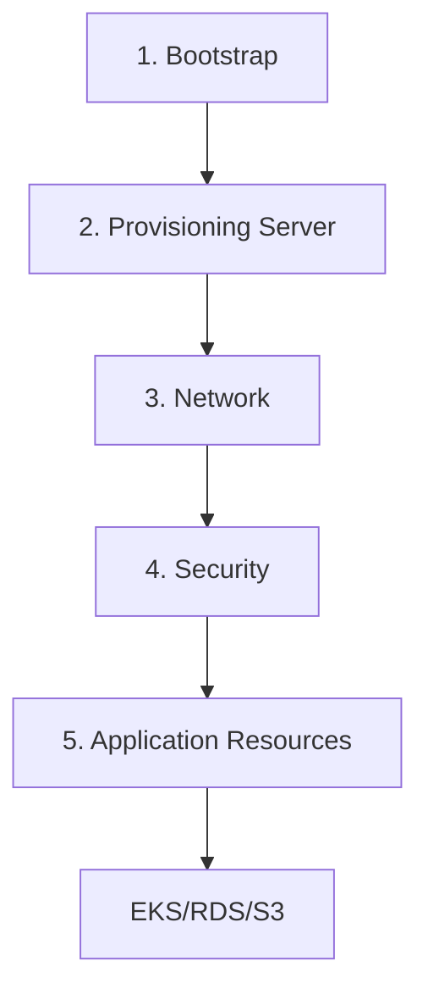

# AWS Terraform Blueprint - Multi-Account Infrastructure

A comprehensive, production-ready Terraform blueprint for deploying and managing AWS resources across multiple accounts (nonprod, staging, production). This blueprint provides reusable modules and account-specific configurations for EC2, S3, EKS, RDS, VPC, and supporting infrastructure.

## 📋 Table of Contents

- [Overview](#overview)
- [Repository Structure](#repository-structure)
- [Prerequisites](#prerequisites)
- [Quick Start](#quick-start)
- [Deployment Workflow](#deployment-workflow)
- [Modules](#modules)
- [Account Structure](#account-structure)
- [Best Practices](#best-practices)
- [Contributing](#contributing)

## 🎯 Overview

This blueprint implements a multi-account AWS infrastructure strategy with:

- **Account Separation**: Isolated nonprod, staging, and production environments
- **Bootstrap Infrastructure**: S3 backend and DynamoDB for state management
- **Provisioning Servers**: Dedicated EC2 instances for running Terraform
- **Reusable Modules**: Network, RDS, S3, EKS, and security modules
- **Security First**: Encryption, IAM roles, deletion protection, and compliance features
- **Scalability**: Multi-AZ deployments, auto-scaling, and high availability

## 📁 Repository Structure

```
terraform-environment-blueprint/
├── modules/                      # Reusable Terraform modules
│   ├── network/                  # VPC, Subnets, NAT, IGW, Flow Logs
│   ├── rds/                      # RDS instances with HA and encryption
│   └── s3/                       # S3 buckets with versioning and lifecycle
│
├── nonprod/                      # NonProd account resources
│   ├── bootstrap/                # S3 backend & IAM setup (run first)
│   ├── provisioning-server/      # EC2 server for Terraform execution
│   ├── network/                  # VPC and networking resources
│   ├── security/                 # Security groups and IAM
│   ├── eks/                      # EKS clusters
│   ├── rds/                      # Database instances
│   └── s3/                       # S3 buckets
│
├── staging/                      # Staging account resources
│   ├── bootstrap/
│   ├── provisioning-server/
│   ├── network/
│   ├── security/
│   ├── eks/
│   ├── rds/
│   └── s3/
│
├── production/                   # Production account resources
│   ├── bootstrap/
│   ├── provisioning-server/
│   ├── network/
│   ├── security/
│   ├── eks/
│   ├── rds/
│   └── s3/
│
└── .github/
    └── copilot-instructions.md   # AI agent instructions
```

## 🔧 Prerequisites

- **Terraform**: >= 1.0
- **AWS CLI**: >= 2.0, configured with appropriate credentials
- **AWS Accounts**: Separate AWS accounts for nonprod, staging, and production
- **Permissions**: AdministratorAccess or equivalent for initial bootstrap

## 🚀 Quick Start

### Step 1: Bootstrap Infrastructure (Per Account)

The bootstrap creates the S3 backend and IAM roles needed for Terraform state management.

```bash
# Navigate to the account's bootstrap directory
cd nonprod/bootstrap

# Initialize and apply
terraform init
terraform plan -var-file=terraform.tfvars
terraform apply -var-file=terraform.tfvars

# Note the outputs - you'll need these values
terraform output
```

**Important**: Run bootstrap for each account (nonprod, staging, production) before proceeding.

### Step 2: Deploy Provisioning Server

The provisioning server is an EC2 instance that will run all subsequent Terraform code.

```bash
# Update terraform.tfvars with VPC and subnet IDs
cd ../provisioning-server

# Edit terraform.tfvars and update backend configuration in main.tf
# Then deploy
terraform init
terraform plan -var-file=terraform.tfvars
terraform apply -var-file=terraform.tfvars
```

### Step 3: Deploy Network Infrastructure

```bash
cd ../network

# Configure backend in main.tf
# Edit terraform.tfvars for your network requirements
terraform init
terraform plan -var-file=terraform.tfvars
terraform apply -var-file=terraform.tfvars
```

### Step 4: Deploy Application Resources

Deploy EKS, RDS, S3, and other resources as needed.

```bash
# Example: Deploy RDS
cd ../rds
terraform init
terraform plan -var-file=terraform.tfvars
terraform apply -var-file=terraform.tfvars
```

## 🔄 Deployment Workflow



### Recommended Order

1. **Bootstrap**: Creates S3 backend and IAM roles
2. **Provisioning Server**: EC2 instance for Terraform execution
3. **Network**: VPC, subnets, NAT gateways, internet gateway
4. **Security**: Security groups, NACLs, IAM policies
5. **Application Resources**: EKS, RDS, S3 based on requirements

## 📦 Modules

### Network Module

Creates VPC infrastructure with public, private, and database subnets.

**Features**:
- Multi-AZ deployment
- NAT Gateways (single or per-AZ)
- VPC Flow Logs
- Customizable CIDR blocks

### RDS Module

Managed relational database instances with enterprise features.

**Features**:
- Multi-AZ deployment
- Automated backups
- Encryption at rest (KMS)
- Performance Insights
- Enhanced monitoring
- Auto-generated passwords (stored in Secrets Manager)

### S3 Module

Secure S3 buckets with compliance features.

**Features**:
- Server-side encryption (AES256 or KMS)
- Versioning
- Lifecycle policies
- Public access blocking
- Intelligent tiering
- Object locking

## 🏢 Account Structure

### Bootstrap

Each account has its own bootstrap infrastructure:
- S3 bucket for Terraform state
- DynamoDB table for state locking
- KMS key for encryption
- IAM roles for Terraform execution

### Provisioning Server

One EC2 instance per account with:
- Pre-installed Terraform, AWS CLI, kubectl, Helm, Docker
- IAM instance profile with necessary permissions
- CloudWatch logging
- SSH access (configurable)

### Configuration Files

Each account directory contains a `terraform.tfvars` file for environment-specific settings:

```hcl
# nonprod/network/terraform.tfvars
project_name = "aws-blueprint"
environment  = "nonprod"
vpc_cidr     = "10.0.0.0/16"
# ... other variables
```

## 🛡️ Best Practices

### Security

1. **Encryption**: All data encrypted at rest using KMS
2. **IAM**: Least privilege access with instance profiles
3. **Secrets**: Passwords stored in AWS Secrets Manager
4. **Network**: Private subnets for compute, public for load balancers
5. **Deletion Protection**: Enabled on critical resources

### State Management

1. **Remote Backend**: S3 with DynamoDB locking
2. **State Encryption**: KMS-encrypted state files
3. **Versioning**: S3 versioning enabled for state recovery
4. **Isolation**: Separate state files per resource type

### Cost Optimization

1. **Single NAT Gateway**: Use in non-production for cost savings
2. **Auto Scaling**: Configure based on workload requirements
3. **Resource Tagging**: Comprehensive tagging for cost allocation
4. **Lifecycle Policies**: Automatic data archiving

### High Availability

1. **Multi-AZ**: Deploy across availability zones
2. **Auto Scaling**: Automatic capacity management
3. **Health Checks**: Monitor and replace unhealthy instances
4. **Backup & Recovery**: Automated backups with point-in-time recovery

## 📖 Additional Documentation

- **Bootstrap**: See `nonprod/bootstrap/README.md`
- **Provisioning Server**: See `nonprod/provisioning-server/README.md`
- **Implementation Summary**: See `IMPLEMENTATION-SUMMARY.md`

## 🤝 Contributing

1. Follow the existing module structure
2. Include comprehensive variables with descriptions
3. Add outputs for all created resources
4. Update documentation and README files
5. Test in nonprod before deploying to higher environments

## 📝 License

This blueprint is provided as-is for use in AWS infrastructure deployment.

## 🆘 Support

For issues, questions, or contributions:
1. Check existing documentation in `docs/`
2. Review module-specific README files
3. Consult the copilot-instructions.md for AI-assisted development

---

**Note**: Always review and customize `terraform.tfvars` files before applying in your environment. Default values are provided as examples and should be adjusted based on your specific requirements.
